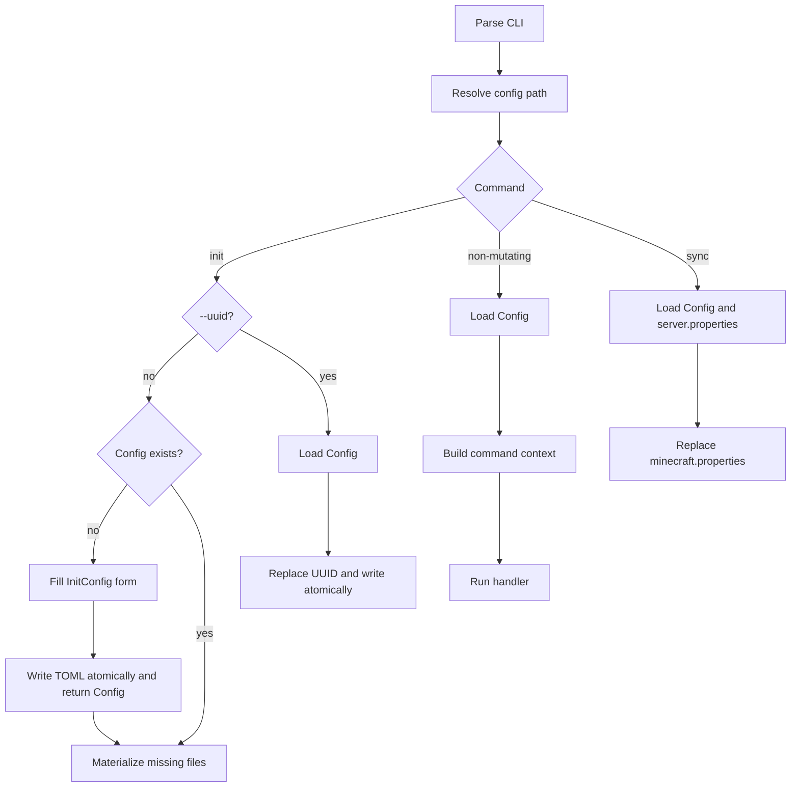

# Commands
## Purpose
Define how the CLI selects configuration, dispatches commands, and presents consistent terminal output.
## Responsibilities
- Parse commands and the global `--config` option with Clap.
- Resolve the configuration path, validate its format version, and deserialize `minegr.toml` with TOML and Serde.
- Dispatch synchronous command handlers with their configuration context.
- Keep prompts and human-facing output consistent through shared UI wrappers.
## Structure
- The entry point performs startup and delegates dispatch.
- The parser owns global and command-specific arguments.
- The dispatcher resolves the configuration path, loads `Config`, and calls the selected handler.
- Command modules own command behaviour. Large handlers use focused helpers.
- The UI module wraps a fixed semantic subset of Dialoguer and Indicatif: prompts, progress, success, warning, and error.

Normal handlers receive a context containing the canonical configuration path and deserialized `Config`. Operations that benefit from async I/O create one Tokio runtime for that invocation; dispatch remains synchronous.
## Data and control flow

Clap supplies `--config <path>` or defaults it to `./minegr.toml`. Relative paths resolve from the current directory. Existing files are canonicalized directly; `init` canonicalizes the existing parent before appending the new filename. The resulting configuration path must be valid UTF-8 for every Command, including `init`.

New-instance `init` skips configuration loading. Focused helpers receive a shared mutable `InitConfig` questionnaire and fill it from CLI values or Dialoguer prompts. `create_config` derives the complete runtime `Config`, writes it, and returns it for validation. Normal `init` with an existing configuration materializes only missing managed files. `init --uuid` instead loads the existing `Config`, changes only its UUID, and rewrites it. `sync` is the other mutating Command and replaces only `[minecraft.properties]` from `server.properties`.

Configuration writes use a temporary file beside the target, flush it, and rename it atomically. Normal `init` never replaces an existing file. Mutation commands preserve comments and formatting outside changed values on a best-effort basis; correct atomic output takes precedence.

Handlers return structured errors. The dispatcher renders the final error once and selects the exit code.

Stable exit categories map success to `0`, usage or configuration failure to `2`, an unavailable server to `3`, an accepted operation failure to `4`, and a foreground interruption to `130`. Clap parse errors retain Clap's standard exit behaviour. Commands for which `Ctrl+C` means successful detachment or normal stream closure return `0`.
## Interfaces
### Inputs
- Parsed global and command-specific arguments.
- One selected `minegr.toml` file, except while normal `init` creates it.
- Interactive answers when required outside CI.
### Outputs
- Command data on stdout.
- Prompts, progress, warnings, and errors on stderr.
- A new or atomically replaced `minegr.toml` from `init` or `sync`.
## Invariants
- `minegr.toml` is the single configuration source; loading uses TOML and Serde without layered configuration.
- The centrally resolved canonical configuration path is valid UTF-8 before any Command loads or creates configuration.
- Only `init` may create configuration. Normal existing-file `init`, `init --uuid`, and `sync` load it for their distinct operations.
- Direct Dialoguer or Indicatif use is confined to the UI module. Raw logs, status data, and Ratatui rendering are explicit exceptions.
- UI callers choose semantic operations, not colors, glyphs, or spinner templates.
- Pretty output requires its destination stream to be a terminal and is disabled when `CI` is `1`, `true`, or `yes`, case-insensitively. Plain output prints every message once without terminal control sequences.
- `NO_COLOR` disables color without disabling other terminal presentation.
- Interactive prompts require terminal stdin and stderr and are forbidden in CI. Missing answers produce an actionable error naming the required flags.
## Related
- [Configuration](configuration.md)
- [Minegr command](../features/commands/minegr.md)
- [Init command](../features/commands/init.md)
- [Sync command](../features/commands/sync.md)
- [Validation](validation.md)
- [Use Dialoguer for interactive prompts](../decisions/0003-use-dialoguer-for-interactive-prompts.md)
- [Sync vs async](../decisions/0002-sync-vs-async.md)
