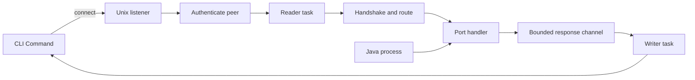

# IPC protocol

## Purpose

Define communication between a persistent server daemon and CLI Command clients over local Unix sockets.

## Responsibilities

- Authenticate clients and validate daemon identity.
- Frame and serialize messages.
- Route each CLI Command's tunnel to one session and its permitted logical ports.
- Support one-shot exchanges and long-lived subscriptions without blocking the daemon.

## Structure

The daemon listens at `$XDG_RUNTIME_DIR/minegr/<uuid>.sock`. Each CLI Command that communicates with the daemon opens one independent full-duplex `UnixStream` connection to that path and splits it into read and write halves. Most Commands use one logical port. The console TUI uses one connection carrying its `Logs`, `Status`, and `Console` ports.

After accepting a connection, the daemon verifies its peer UID and splits the `UnixStream`. One task owns the read half. Response producers send typed `Message` values through a 32-message `mpsc` channel to one task that serializes and owns the write half.

Top-level message variants act as logical ports. A port is a routing boundary, not necessarily a task or channel. Stateful subsystems use channels where they need ownership, ordering, or backpressure; the console port uses one `mpsc` queue for global FIFO ordering.

```rust
enum Exchange<Req, Res> {
    Request(Req),
    Response(Res),
    Close,
    Closed(CloseReason),
}

enum CloseReason {
    Requested,
    DaemonStopping,
    FellBehind,
}

enum HandshakeResponse {
    Accepted,
    Rejected(HandshakeError),
}

enum Message {
    Handshake(Exchange<HandshakeRequest, HandshakeResponse>),
    Start(Exchange<StartRequest, StartResponse>),
    Stop(Exchange<StopRequest, StopResponse>),
    Logs(Exchange<LogsRequest, LogsResponse>),
    Console(Exchange<ConsoleRequest, ConsoleResponse>),
    Status(Exchange<StatusRequest, StatusResponse>),
    // Other daemon-backed operations.
    ProtocolError(ProtocolError),
}
```

Request and response payloads are distinct structs. Response types may represent updates and terminal outcomes. Serializable wire errors contain stable codes and safe fields; internal errors map into them at the tunnel boundary. Both may derive `thiserror::Error`; Minegr does not use `anyhow`.

## Data and control flow



Every tunnel starts with a handshake containing `env!("CARGO_PKG_VERSION")`, the server UUID, and canonical configuration path. Paths must be valid UTF-8. Every CLI Command, including `stop`, requires an exact Minegr-version match. A rejected handshake reports both Minegr versions and closes the tunnel. Minegr does not provide a release-compatible stop path; after updating the binary while an older daemon is running, the user may need to terminate the old daemon and Java process manually.

`StopRequest` has no fields. `StopResponse` contains `Requested`, `Stopped`, and `Failed` within the protocol used between matching Minegr versions.

The first accepted stop request enters daemon shutdown and receives `Requested`. New handshakes receive `Rejected(HandshakeError::DaemonStopping)` while existing tunnels stop accepting requests. The daemon keeps the listener and socket until shutdown completes, lets an active backup finish or restore saving, drains accepted Console inputs, cancels restart startup, stops Java, drains its output, and sends `Stopped`. Remaining tunnels receive `Closed(DaemonStopping)` before the socket is removed. A restart cancelled by stop receives `CancelledByStop` first.

After the handshake, the first Message variant locks the tunnel to a Command session. Most sessions permit only that variant. A console-opening request selects the composite console session, which permits only `Logs`, `Status`, and `Console` variants on the same tunnel. The client keeps at most one unanswered request per permitted port, so the console's log and status subscriptions may coexist with one pending Console input. Responses may contain updates, followed by exactly one terminal outcome per request. Short-lived tunnels then close. Subscriptions accept `Exchange::Close`, reply with `Closed(Requested)`, and also end on EOF.

Each message derives Serde's standard `Serialize` and `Deserialize` implementations. Its compact JSON payload is prefixed by a four-byte big-endian length. Zero-length and payloads over 16 MiB are rejected. Rust field and variant names are therefore part of the wire schema. Invalid framing, JSON, message order, or port use returns `ProtocolError` when possible and closes the tunnel.

Log history and live entries use the same ordered response and may be split across frames. Normal batches target at most 64 KiB of serialized JSON; a larger line below 16 MiB is sent alone. A client receives one consistent tail followed by every later entry exactly once, without a gap. A line exceeding 16 MiB is replaced in the stream by `Line exceeds the 16 MiB protocol limit; see <server-root>/logs/latest.log`.

Status subscriptions send one initial state and later state changes; CPU and memory metrics remain one-shot status data. At final shutdown, subscribers receive remaining logs, the final `stopped` state, then `Closed(DaemonStopping)`.

Each console tunnel has a client UUID and an increasing `u64` Console input ID starting at one. The client increments only after acknowledgement. The daemon stores only that connection's highest accepted ID; an ID less than or equal to it is acknowledged without enqueueing. Connection loss clears this state and Console inputs are never retried automatically.

## Interfaces

### Inputs

- Length-prefixed JSON `Message` values from an authenticated local client.
- Java logs, lifecycle state, and command results from daemon subsystems.

### Outputs

- Ordered response messages to the requesting tunnel.
- Log and status updates to their current subscribers.
- Console inputs to one daemon-owned FIFO queue.

## Invariants

- Connections are independent byte streams, not a shared event log.
- No transport-level request or subscription identifiers are used; the tunnel and message port provide routing.
- Only the writer task serializes and writes frames to a tunnel.
- A full streaming response queue disconnects only that slow tunnel. Closing a composite console tunnel ends its `Logs`, `Status`, and `Console` ports together without affecting other clients. One-time responses use a five-second per-frame write timeout.
- Graceful completion drains queued responses through the terminal message. Protocol errors, slow subscribers, and broken tunnels discard remaining queued messages.
- No heartbeat is required; EOF and write failure detect lost clients.
- Tunnel closure follows Command semantics: subscriptions detach, acknowledged Console inputs remain queued, accepted stop and restart operations continue, and an initiating start disconnect cancels startup before readiness.
- Multiple console clients are allowed. Complete Console inputs enter one FIFO in daemon-accepted order and are acknowledged after enqueueing.
- The runtime directory is mode `0700`, the socket is mode `0600`, and the daemon accepts only its owner's UID.
- Missing `XDG_RUNTIME_DIR` is an error; Minegr never falls back to `/tmp`.
- Handshake and first-Message setup has a five-second timeout. Established subscriptions have no idle timeout.
- Each daemon accepts at most 128 simultaneous tunnels. Excess connections receive `Rejected(HandshakeError::TunnelLimit)` without starting port tasks.
- Released Minegr versions uniquely identify their wire schema. Minegr makes no cross-version wire-compatibility guarantee.
- During shutdown the listener remains responsive only to report `DaemonStopping`; it dispatches no new work.
- The daemon removes its socket after Java exits and shutdown work drains. `start` removes a stale path only when it is an owner-matched Unix socket with no responsive daemon.

## Related

- [Daemon](../features/daemon.md)
- [Glossary](../glossary.md)
- [Logs command](../features/commands/logs.md)
- [Console command](../features/commands/console.md)
- [Frame messages over Unix streams](../decisions/0004-frame-messages-over-unix-streams.md)
- [Use one or two IPC tunnels](../decisions/0005-use-one-or-two-ipc-tunnels.md)
- [Sync vs async](../decisions/0002-sync-vs-async.md)
